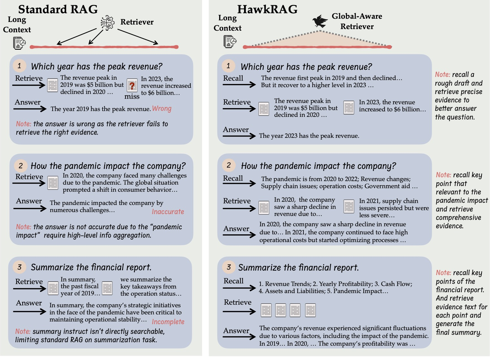
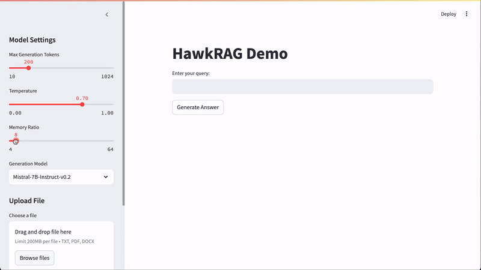

# 
Memory RAG: Bridge Long Context and Complex Tasks via Memory-Inspired Retrieval

<h4 align="center">

<a href="#wrench-installation">Installation</a> |
<a href="#sparkles-features">Features</a> |
<a href="#running-quick-start">Quick-Start</a> |
<a href="#gear-components"> Components</a> |
<a href="#raised_hands-additional-faqs"> FAQs</a>

</h4>
HawkRAG

</h4>
HawkRAG Demo

  

    
  

